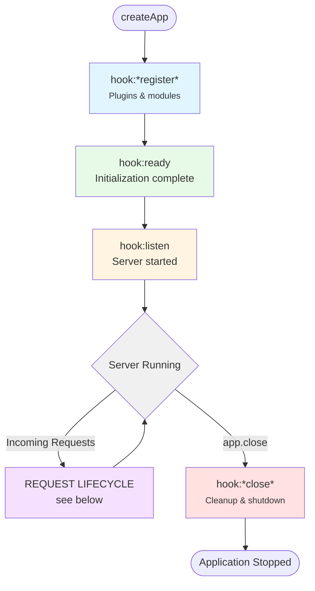

```mermaid
graph TD
    Start([createApp]) --> Register
    Register[hook:*register*<br/><small>Plugins & modules] --> Ready
    Ready[hook:ready<br/>Initialization complete] --> Listen
    Listen[hook:listen<br/>Server started] --> Serving{Server Running}
    Serving -->|Incoming Requests| RequestCycle[REQUEST LIFECYCLE<br/>see below]
    RequestCycle --> Serving
    Serving -->|app.close| Close[hook:*close*<br/><small>Cleanup & shutdown</small>]
    Close --> End([Application Stopped])

    style Register fill:#e1f5ff
    style Ready fill:#e7f9e7
    style Listen fill:#fff4e1
    style Serving fill:#f0f0f0
    style Close fill:#ffe1e1
    style RequestCycle fill:#f5e1ff
```
