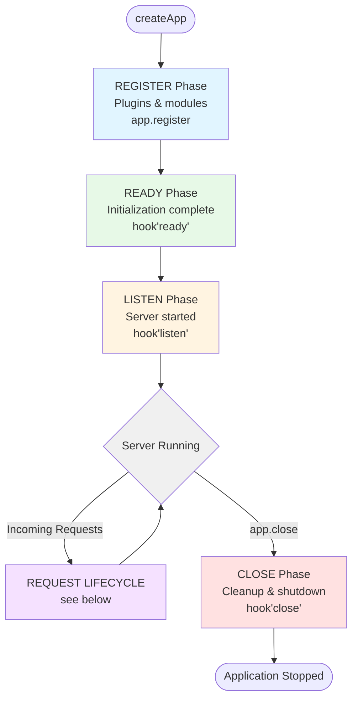

```mermaid
graph TD
    Start([createApp]) --> Register
    Register[REGISTER Phase<br/>Plugins & modules<br/>app.register] --> Ready
    Ready[READY Phase<br/>Initialization complete<br/>hook'ready'] --> Listen
    Listen[LISTEN Phase<br/>Server started<br/>hook'listen'] --> Serving{Server Running}
    Serving -->|Incoming Requests| RequestCycle[REQUEST LIFECYCLE<br/>see below]
    RequestCycle --> Serving
    Serving -->|app.close| Close[CLOSE Phase<br/>Cleanup & shutdown<br/>hook'close']
    Close --> End([Application Stopped])

    style Register fill:#e1f5ff
    style Ready fill:#e7f9e7
    style Listen fill:#fff4e1
    style Serving fill:#f0f0f0
    style Close fill:#ffe1e1
    style RequestCycle fill:#f5e1ff
```
