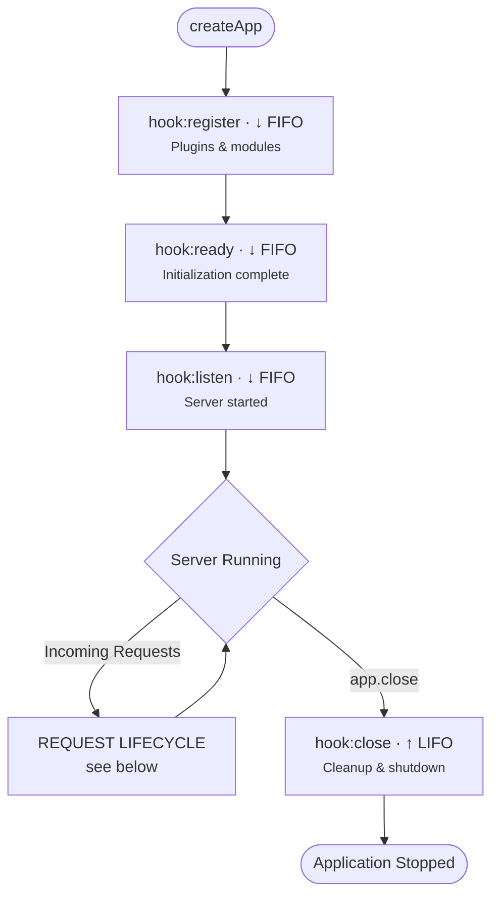

```mermaid
graph TD
    Start([createApp]) --> Register
    Register["hook:register · ↓ FIFO<br/><small>Plugins & modules</small>"] --> Ready
    Ready["hook:ready · ↓ FIFO<br/><small>Initialization complete</small>"] --> Listen
    Listen["hook:listen · ↓ FIFO<br/><small>Server started</small>"] --> Serving{Server Running}
    Serving -->|Incoming Requests| RequestCycle[REQUEST LIFECYCLE<br/>see below]
    RequestCycle --> Serving
    Serving -->|app.close| Close["hook:close · ↑ LIFO<br/><small>Cleanup & shutdown</small>"]
    Close --> End([Application Stopped])

    class Start,Ready,End success
    class Register,RequestCycle accent
    class Listen warn
    class Close danger
    class Serving neutral

```
