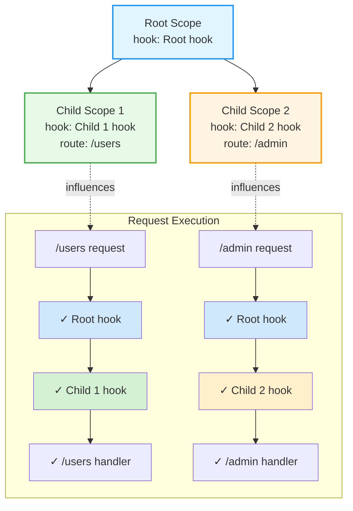

```mermaid
graph TB
    Root[Root Scope<br/>hook: Root hook]
    Root --> Child1[Child Scope 1<br/>hook: Child 1 hook<br/>route: /users]
    Root --> Child2[Child Scope 2<br/>hook: Child 2 hook<br/>route: /admin]

    subgraph Execution["Request Execution"]
        direction TB
        U1["/users request"] --> UE1[✓ Root hook] --> UE2[✓ Child 1 hook] --> UE3[✓ /users handler]
        A1["/admin request"] --> AE1[✓ Root hook] --> AE2[✓ Child 2 hook] --> AE3[✓ /admin handler]
    end

    Child1 -.->|influences| U1
    Child2 -.->|influences| A1

    style Root fill:#e1f5ff,stroke:#2196f3,stroke-width:2px
    style Child1 fill:#e7f9e7,stroke:#4caf50,stroke-width:2px
    style Child2 fill:#fff4e1,stroke:#ff9800,stroke-width:2px
    style UE1 fill:#cfe8fc
    style UE2 fill:#d4f1d4
    style AE1 fill:#cfe8fc
    style AE2 fill:#fff0cc
```
