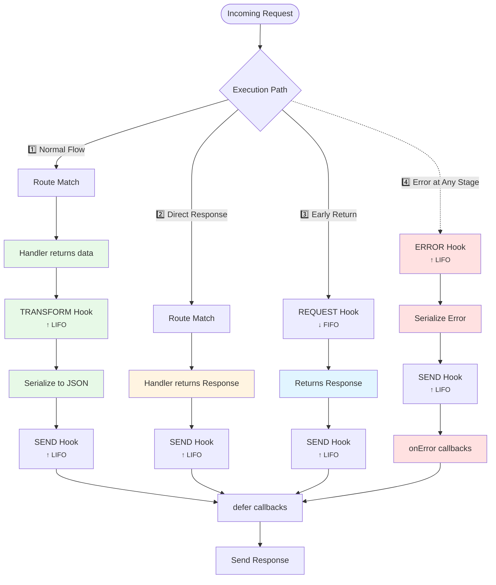

```mermaid
graph TD
    Start([Incoming Request]) --> Choice{Execution Path}

    Choice -->|1️⃣ Normal Flow| N1[Route Match]
    N1 --> N2[Handler returns data]
    N2 --> N3["TRANSFORM Hook<br/><small>↑ LIFO</small>"]
    N3 --> N4[Serialize to JSON]
    N4 --> N5["SEND Hook<br/><small>↑ LIFO</small>"]
    N5 --> N6[defer callbacks]
    N6 --> N7[Send Response]

    Choice -->|2️⃣ Direct Response| D1[Route Match]
    D1 --> D2[Handler returns Response]
    D2 --> D5["SEND Hook<br/><small>↑ LIFO</small>"] --> N6

    Choice -->|3️⃣ Early Return| E1["REQUEST Hook<br/><small>↓ FIFO</small>"]
    E1 --> E2[Returns Response]
    E2 --> E5["SEND Hook<br/><small>↑ LIFO</small>"] --> N6

    Choice -.->|4️⃣ Error at Any Stage| R1["ERROR Hook<br/><small>↑ LIFO</small>"]
    R1 --> R2[Serialize Error]
    R2 --> R3["SEND Hook<br/><small>↑ LIFO</small>"]
    R3 --> R4[onError callbacks] --> N6

    style N2 fill:#e7f9e7
    style N3 fill:#e7f9e7
    style N4 fill:#e7f9e7
    style D2 fill:#fff4e1
    style E2 fill:#e1f5ff
    style R1 fill:#ffe1e1
    style R2 fill:#ffe1e1
    style R4 fill:#ffe1e1
```
