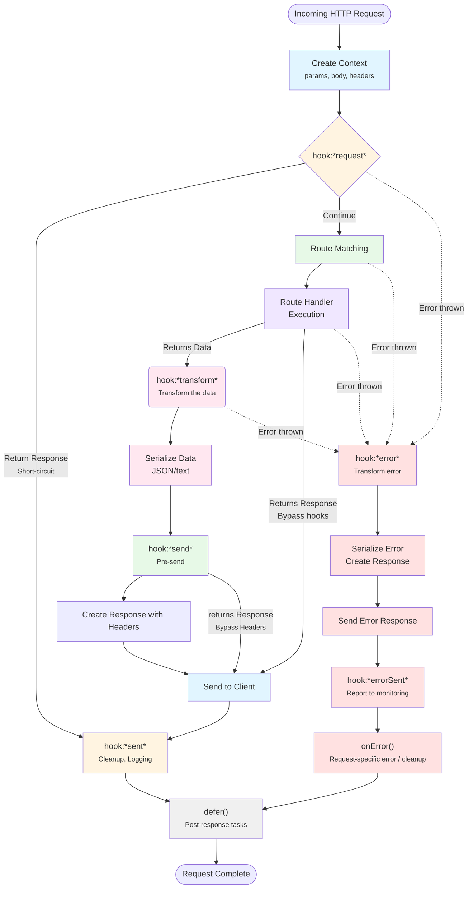

```mermaid
graph TD
    Start([Incoming HTTP Request]) --> CreateCtx[Create Context <br/> <small>params, body, headers</small>]
    CreateCtx --> ReqHook{"hook:*request*"}

    ReqHook --> |Return Response<br/><small>Short-circuit</small>| SentHook
    ReqHook --> |Continue| RouteMatch[Route Matching]

    RouteMatch --> Handler[Route Handler<br/>Execution]

    Handler -->|Returns Data| Transform(hook:*transform*<br/><small>Transform the data</small>)
    Handler -->|Returns Response<br/>Bypass hooks| SendResp

    Transform --> Serialize[Serialize Data<br/>JSON/text]
    Serialize --> SendHook[hook:*send*<br/><small>Pre-send</small>]

    CreateResp[Create Response with Headers] --> SendResp

    SendHook --> CreateResp

    SendHook --> |returns Response <br/> <small>Bypass Headers</small>| SendResp[Send to Client]

    SendResp --> SentHook[hook:*sent*<br/><small>Cleanup, Logging</small>]
    SentHook --> Defer["defer()"<br/><small>Post-response tasks</small>]
    Defer --> Complete([Request Complete])

    %% Error Path
    ReqHook -.->|Error thrown| ErrorHook
    RouteMatch -.->|Error thrown| ErrorHook
    Handler -.->|Error thrown| ErrorHook
    Transform -.->|Error thrown| ErrorHook

    ErrorHook[hook:*error*<br/><small>Transform error</small>] --> SerializeErr[Serialize Error<br/>Create Response]
    SerializeErr --> SendErr[Send Error Response]
    SendErr --> ErrorSent[hook:*errorSent*<br/><small>Report to monitoring</small>]
    ErrorSent --> OnError["onError()"<br/><small>Request-specific error / cleanup</small>] --> Defer

    style CreateCtx fill:#e1f5ff
    style ReqHook fill:#fff4e1
    style RouteMatch fill:#e7f9e7
    style Handler fill:#f0e7ff
    style Transform fill:#ffe7f0
    style Serialize fill:#ffe7f0
    style SendHook fill:#e7f9e7
    style SendResp fill:#e1f5ff
    style SentHook fill:#fff4e1
    style Defer fill:#f0f0f0
    style ErrorHook fill:#ffe1e1
    style SerializeErr fill:#ffe1e1
    style SendErr fill:#ffe1e1
    style ErrorSent fill:#ffe1e1
    style OnError fill:#ffe1e1
```
