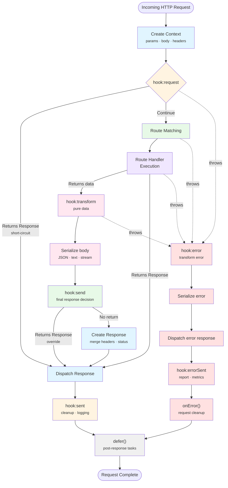

```mermaid
graph TD
    Start([Incoming HTTP Request])
    Start --> CreateCtx["Create Context<br/><small>params · body · headers</small>"]

    CreateCtx --> ReqHook{"hook:request"}

    ReqHook -->|Returns Response<br/><small>short-circuit</small>| FinalResponse
    ReqHook -->|Continue| RouteMatch["Route Matching"]

    RouteMatch --> Handler["Route Handler<br/>Execution"]

    Handler -->|Returns data| Transform["hook:transform<br/><small>pure data</small>"]
    Handler -->|Returns Response| FinalResponse

    Transform --> Serialize["Serialize body<br/><small>JSON · text · stream</small>"]

    Serialize --> SendHook["hook:send<br/><small>final response decision</small>"]

    SendHook -->|Returns Response<br/><small>override</small>| FinalResponse
    SendHook -->|No return| CreateResp["Create Response<br/><small>merge headers · status</small>"]

    CreateResp --> FinalResponse["Dispatch Response"]

    FinalResponse --> SentHook["hook:sent<br/><small>cleanup · logging</small>"]
    SentHook --> Defer["defer()<br/><small>post-response tasks</small>"]
    Defer --> Complete([Request Complete])

    %% Error Flow
    ReqHook -.->|throws| ErrorHook
    RouteMatch -.->|throws| ErrorHook
    Handler -.->|throws| ErrorHook
    Transform -.->|throws| ErrorHook

    ErrorHook["hook:error<br/><small>transform error</small>"]
        --> SerializeErr["Serialize error"]
        --> DispatchErr["Dispatch error response"]
        --> ErrorSent["hook:errorSent<br/><small>report · metrics</small>"]
        --> OnError["onError()<br/><small>request cleanup</small>"]
        --> Defer

    %% Styling
    style CreateCtx fill:#e1f5ff
    style ReqHook fill:#fff4e1
    style RouteMatch fill:#e7f9e7
    style Handler fill:#f0e7ff
    style Transform fill:#ffe7f0
    style Serialize fill:#ffe7f0
    style SendHook fill:#e7f9e7
    style CreateResp fill:#e1f5ff
    style FinalResponse fill:#e1f5ff
    style SentHook fill:#fff4e1
    style Defer fill:#f0f0f0

    style ErrorHook fill:#ffe1e1
    style SerializeErr fill:#ffe1e1
    style DispatchErr fill:#ffe1e1
    style ErrorSent fill:#ffe1e1
    style OnError fill:#ffe1e1

```
