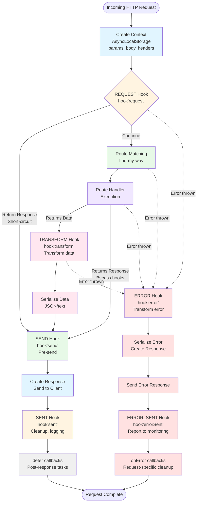

```mermaid
graph TD
    Start([Incoming HTTP Request]) --> CreateCtx[Create Context<br/>AsyncLocalStorage<br/>params, body, headers]
    CreateCtx --> ReqHook{REQUEST Hook<br/>hook'request'}

    ReqHook -->|Return Response<br/>Short-circuit| SendHook
    ReqHook -->|Continue| RouteMatch[Route Matching<br/>find-my-way]

    RouteMatch --> Handler[Route Handler<br/>Execution]

    Handler -->|Returns Data| Transform[TRANSFORM Hook<br/>hook'transform'<br/>Transform data]
    Handler -->|Returns Response<br/>Bypass hooks| SendHook

    Transform --> Serialize[Serialize Data<br/>JSON/text]
    Serialize --> SendHook[SEND Hook<br/>hook'send'<br/>Pre-send]

    SendHook --> SendResp[Create Response<br/>Send to Client]
    SendResp --> SentHook[SENT Hook<br/>hook'sent'<br/>Cleanup, logging]
    SentHook --> Defer[defer callbacks<br/>Post-response tasks]
    Defer --> Complete([Request Complete])

    %% Error Path
    ReqHook -.->|Error thrown| ErrorHook
    RouteMatch -.->|Error thrown| ErrorHook
    Handler -.->|Error thrown| ErrorHook
    Transform -.->|Error thrown| ErrorHook

    ErrorHook[ERROR Hook<br/>hook'error'<br/>Transform error] --> SerializeErr[Serialize Error<br/>Create Response]
    SerializeErr --> SendErr[Send Error Response]
    SendErr --> ErrorSent[ERROR_SENT Hook<br/>hook'errorSent'<br/>Report to monitoring]
    ErrorSent --> OnError[onError callbacks<br/>Request-specific cleanup]
    OnError --> Complete

    style CreateCtx fill:#e1f5ff
    style ReqHook fill:#fff4e1
    style RouteMatch fill:#e7f9e7
    style Handler fill:#f0e7ff
    style Transform fill:#ffe7f0
    style Serialize fill:#ffe7f0
    style SendHook fill:#e7f9e7
    style SendResp fill:#e1f5ff
    style SentHook fill:#fff4e1
    style Defer fill:#f0f0f0
    style ErrorHook fill:#ffe1e1
    style SerializeErr fill:#ffe1e1
    style SendErr fill:#ffe1e1
    style ErrorSent fill:#ffe1e1
    style OnError fill:#ffe1e1
```
