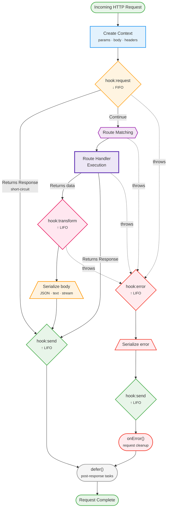

```mermaid
graph TD
    Start([Incoming HTTP Request])
    Start --> CreateCtx["Create Context<br/><small>params · body · headers</small>"]

    CreateCtx --> ReqHook{"hook:request<br/><small>↓ FIFO</small>"}

    ReqHook -->|Returns Response<br/><small>short-circuit</small>| SendHook
    ReqHook -->|Continue| RouteMatch{{"Route Matching"}}

    RouteMatch --> Handler["Route Handler<br/>Execution"]

    Handler -->|Returns data| Transform{"hook:transform<br/><small>↑ LIFO</small>"}
    Handler -->|Returns Response| SendHook

    Transform --> Serialize[/"Serialize body<br/><small>JSON · text · stream</small>"\]

    Serialize --> SendHook{"hook:send<br/><small>↑ LIFO</small>"}

    SendHook --> Defer(["defer()<br/><small>post-response tasks</small>"])
    Defer --> Complete([Request Complete])

    %% Error Flow
    ReqHook -.->|throws| ErrorHook
    RouteMatch -.->|throws| ErrorHook
    Handler -.->|throws| ErrorHook
    Transform -.->|throws| ErrorHook

    ErrorHook{"hook:error<br/><small>↑ LIFO</small>"}
        --> SerializeErr[/"Serialize error"\]
        --> ErrorSendHook{"hook:send<br/><small>↑ LIFO</small>"}
        --> OnError(["onError()<br/><small>request cleanup</small>"])
        --> Defer

    %% Styling - Hooks (diamonds)
    style ReqHook fill:#fff4e1,stroke:#ffa726,stroke-width:2px
    style Transform fill:#ffe7f0,stroke:#e91e63,stroke-width:2px
    style SendHook fill:#e8f5e9,stroke:#4caf50,stroke-width:2px
    style ErrorHook fill:#ffebee,stroke:#f44336,stroke-width:2px
    style ErrorSendHook fill:#e8f5e9,stroke:#4caf50,stroke-width:2px

    %% Initialization & Context
    style CreateCtx fill:#e3f2fd,stroke:#2196f3,stroke-width:2px

    %% Routing & Matching
    style RouteMatch fill:#f3e5f5,stroke:#9c27b0,stroke-width:2px

    %% Main Processing
    style Handler fill:#ede7f6,stroke:#673ab7,stroke-width:3px

    %% Data Transformation (parallelograms)
    style Serialize fill:#fff3e0,stroke:#ff9800,stroke-width:2px
    style SerializeErr fill:#ffebee,stroke:#f44336,stroke-width:2px

    %% Cleanup & Lifecycle (stadiums)
    style Defer fill:#f5f5f5,stroke:#9e9e9e,stroke-width:2px
    style OnError fill:#ffebee,stroke:#f44336,stroke-width:2px

    %% Start/End
    style Start fill:#e8f5e9,stroke:#4caf50,stroke-width:2px
    style Complete fill:#e8f5e9,stroke:#4caf50,stroke-width:2px
```
