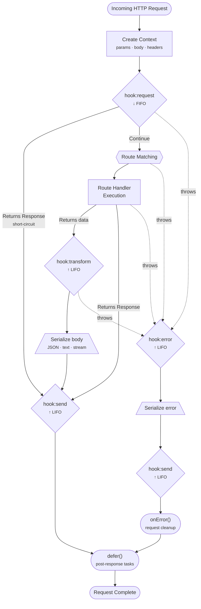

```mermaid
graph TD
    Start([Incoming HTTP Request])
    Start --> CreateCtx["Create Context<br/><small>params · body · headers</small>"]

    CreateCtx --> ReqHook{"hook:request<br/><small>↓ FIFO</small>"}

    ReqHook -->|Returns Response<br/><small>short-circuit</small>| SendHook
    ReqHook -->|Continue| RouteMatch{{"Route Matching"}}

    RouteMatch --> Handler["Route Handler<br/>Execution"]

    Handler -->|Returns data| Transform{"hook:transform<br/><small>↑ LIFO</small>"}
    Handler -->|Returns Response| SendHook

    Transform --> Serialize[/"Serialize body<br/><small>JSON · text · stream</small>"\]

    Serialize --> SendHook{"hook:send<br/><small>↑ LIFO</small>"}

    SendHook --> Defer(["defer()<br/><small>post-response tasks</small>"])
    Defer --> Complete([Request Complete])

    %% Error Flow
    ReqHook -.->|throws| ErrorHook
    RouteMatch -.->|throws| ErrorHook
    Handler -.->|throws| ErrorHook
    Transform -.->|throws| ErrorHook

    ErrorHook{"hook:error<br/><small>↑ LIFO</small>"}
        --> SerializeErr[/"Serialize error"\]
        --> ErrorSendHook{"hook:send<br/><small>↑ LIFO</small>"}
        --> OnError(["onError()<br/><small>request cleanup</small>"])
        --> Defer

    class Start,Complete success
    class CreateCtx info
    class ReqHook,Transform accent
    class RouteMatch,Handler neutral
    class Serialize warn
    class SendHook,Defer accent
    class ErrorHook,SerializeErr,OnError danger
    class ErrorSendHook warn
```
