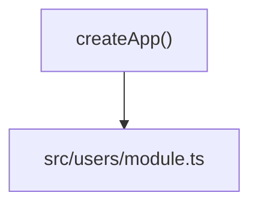
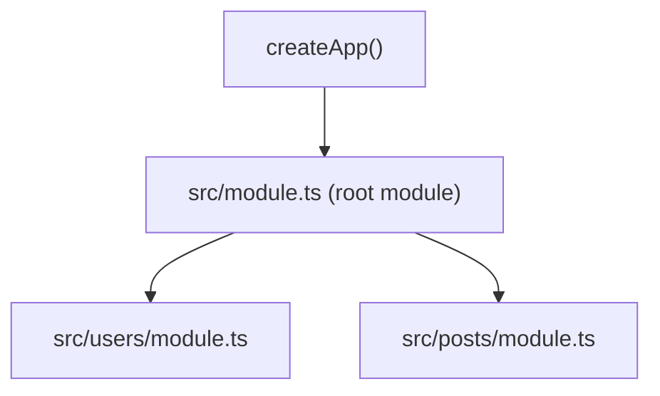

# Building with File-Based Modules

Learn how to structure your Minima.js application using filesystem-based modules. By the end of this tutorial, you'll understand how to organize features into modules, scope plugins, and build scalable APIs using nothing but your file structure.

## What You'll Learn

- Creating your first auto-discovered module
- Adding plugins to modules with `meta.plugins`
- Building nested module hierarchies
- Setting up global configuration with a root module
- Customizing module discovery behavior

## Prerequisites

This tutorial assumes you have a basic Minima.js app with an entry point (`src/index.ts`). If not, see [Getting Started](/getting-started) first.

---

## Step 1: Create Your First Module

Let's start by creating a simple users module. Minima.js will automatically discover any file named `module.ts` in subdirectories.

**1. Create the directory structure:**

```
src/
├── index.ts
└── users/
    └── module.ts  # This will be auto-discovered
```

**2. Write your first module:**

::: code-group

```typescript [src/users/module.ts]
import type { Routes } from "@minimajs/server";
import { params } from "@minimajs/server";

const users = [
  { id: 1, name: "Alice" },
  { id: 2, name: "Bob" },
];

function listUsers() {
  return users;
}

function getUser() {
  const id = params.get("id");
  return users.find((u) => u.id === Number(id));
}

export const routes: Routes = {
  "GET /list": listUsers,
  "GET /:id": getUser,
};
```

```typescript [src/index.ts]
import { createApp } from "@minimajs/server/bun";

const app = createApp(); // Auto-discovers users/module.ts

await app.listen({ port: 3000 });
```

:::

**3. Test it:**

```bash
curl http://localhost:3000/users/list
# → [{"id":1,"name":"Alice"},{"id":2,"name":"Bob"}]

curl http://localhost:3000/users/1
# → {"id":1,"name":"Alice"}
```

🎉 **What just happened?**

- Minima.js found `users/module.ts` automatically
- The directory name (`users`) became the route prefix (`/users`)
- Your routes (`/list` and `/:id`) were mounted under `/users`

---

## Step 2: Add Plugins to Your Module

Now let's add some plugins to our users module - like request logging and CORS.

**1. Add the `meta` export with plugins:**

::: code-group

```typescript [src/users/module.ts]
import type { Meta, Routes } from "@minimajs/server";
import { hook, params } from "@minimajs/server";
import { cors } from "@minimajs/server/plugins";

const users = [
  { id: 1, name: "Alice" },
  { id: 2, name: "Bob" },
];

// Register plugins in meta.plugins
export const meta: Meta = {
  plugins: [
    cors(), // Enable cors for this module
    hook("request", ({ request }) => {
      console.log(`[Users] ${request.method} ${request.url}`);
    }),
  ],
};

function listUsers() {
  return users;
}

function getUser() {
  const id = params.get("id");
  return users.find((u) => u.id === Number(id));
}

export const routes: Routes = {
  "GET /list": listUsers,
  "GET /:id": getUser,
};
```

:::

**2. Test the routes:**

```bash
curl http://localhost:3000/users/list
# → [{"id":1,"name":"Alice"},{"id":2,"name":"Bob"}]

# Check your server logs - you'll see the logging hook output
```

✨ **Key Concept:** Plugins in `meta.plugins` are **scoped to the module**. They only affect routes in this module, not others.

---

## Step 3: Create a Nested Module

Let's add a nested module for user profiles. This demonstrates how modules can be organized hierarchically.

**1. Create the nested structure:**

```
src/
├── index.ts
└── users/
    ├── module.ts
    └── profile/
        └── module.ts  # Nested module
```

**2. Create the nested module:**

::: code-group

```typescript [src/users/profile/module.ts]
import type { Routes } from "@minimajs/server";
import { params } from "@minimajs/server";

function getProfile() {
  const userId = params.get("userId");
  return {
    userId,
    bio: "User profile for " + userId,
    settings: { theme: "dark" },
  };
}

export const routes: Routes = {
  "GET /:userId": getProfile,
};
```

:::

**3. Test the nested route:**

```bash
curl http://localhost:3000/users/profile/1
# → {"userId":"1","bio":"User profile for 1",...}
```

📁 **Route Structure:**

- `src/users/module.ts` → `/users/*`
- `src/users/profile/module.ts` → `/users/profile/*`

The prefixes stack automatically!

---

## Step 4: Share Config with a Parent Module

What if you want multiple child modules to share plugins? Use a parent module.

**1. Restructure to use a parent:**

```
src/
├── index.ts
└── api/
    ├── module.ts       # Parent module
    ├── users/
    │   └── module.ts   # Child 1
    └── posts/
        └── module.ts   # Child 2
```

**2. Create the parent module with shared plugins:**

::: code-group

```typescript [src/api/module.ts]
import type { Meta, Routes } from "@minimajs/server";
import { cors } from "@minimajs/server/plugins";

// These plugins apply to ALL child modules
export const meta: Meta = {
  prefix: "/api/v1",
  plugins: [cors({ origin: "*" })],
};

function getHealth() {
  return { status: "ok" };
}

export const routes: Routes = {
  "GET /health": getHealth,
};
```

```typescript [src/api/users/module.ts]
import type { Routes } from "@minimajs/server";

function listUsers() {
  return { users: [] };
}

// No need to register cors - inherited from parent!
export const routes: Routes = {
  "GET /list": listUsers,
};
```

```typescript [src/api/posts/module.ts]
import type { Routes } from "@minimajs/server";

function listPosts() {
  return { posts: [] };
}

// Also inherits CORS from parent
export const routes: Routes = {
  "GET /list": listPosts,
};
```

:::

**3. Check the resulting routes:**

- `GET /api/v1/health` (parent)
- `GET /api/v1/users/list` (child, with inherited plugins)
- `GET /api/v1/posts/list` (child, with inherited plugins)

🎯 **Inheritance:** Child modules automatically get their parent's prefix and plugins!

---

## How Parent-Child Module Resolution Works

When you call `createApp()` from `src/index.ts`, module discovery root is usually `src/`.

### Case 1: No `src/module.ts`

If there is no root module file, discovered feature modules become direct children of the app scope.

```
src/
├── index.ts
└── users/
    └── module.ts
```



In this case:

- `src/users/module.ts` is mounted directly under app scope.
- Its own `meta.prefix` and plugins apply to itself (and its nested children, if any).

### Case 2: `src/module.ts` exists

If `src/module.ts` exists, it becomes the root module under app scope, and other discovered modules become its children.

```
src/
├── index.ts
├── module.ts
├── users/
│   └── module.ts
└── posts/
    └── module.ts
```



In this case:

- `src/module.ts` is the direct child of app scope.
- `src/users/module.ts`, `src/posts/module.ts`, and other discovered modules inherit from that root module.
- Root `meta.plugins` and root `meta.prefix` propagate to all children.

---

## Step 5: Set Up a Root Module (Global Config)

For truly global configuration that applies to **every module**, create a root module in your discovery root.

**1. Create a root module:**

```
src/
├── index.ts
├── module.ts        # ROOT module - applies to everything
├── users/
│   └── module.ts
└── posts/
    └── module.ts
```

**2. Add global plugins in the root module:**

::: code-group

```typescript [src/module.ts]
import type { Meta, Routes } from "@minimajs/server";
import { cors } from "@minimajs/server/plugins";
import { hook } from "@minimajs/server";

// 🌍 Global configuration - inherited by ALL modules
export const meta: Meta = {
  prefix: "/api",
  plugins: [
    cors({ origin: "*" }), // All routes get CORS
    hook("request", ({ request }) => {
      console.log(`[Global] ${request.method} ${request.url}`);
    }),
  ],
};

function getHealth() {
  return { status: "ok" };
}

export const routes: Routes = {
  "GET /health": getHealth,
};
```

:::

**3. Now every module gets these plugins automatically:**

::: code-group

```typescript [src/users/module.ts]
import type { Routes } from "@minimajs/server";

function listUsers() {
  return { users: [] };
}

// No CORS here - inherited from root!
export const routes: Routes = {
  "GET /list": listUsers,
};
```

:::

**Resulting structure:**

- `GET /api/health` (root)
- `GET /api/users/list` (inherits `/api` prefix + all plugins)
- `GET /api/posts/list` (inherits `/api` prefix + all plugins)

💡 **Best Practice:** Put authentication, CORS, rate limiting, and global logging in the root module.

## Common Patterns

### Pattern 1: API Versioning

```
src/
├── module.ts         # Root with global auth
├── v1/
│   ├── module.ts     # Prefix: /api/v1
│   ├── users/
│   │   └── module.ts
│   └── posts/
│       └── module.ts
└── v2/
    ├── module.ts     # Prefix: /api/v2
    └── users/
        └── module.ts
```

### Pattern 2: Public vs Protected Routes

::: code-group

```typescript [src/module.ts]
import { authPlugin } from "./plugins/auth.js";

// Root module - makes auth available everywhere
export const meta: Meta = {
  plugins: [authPlugin],
};
```

```typescript [src/public/module.ts]
import type { Routes } from "@minimajs/server";

function login() {
  /* ... */
}

// No guard - anyone can access
export const routes: Routes = {
  "POST /login": login,
};
```

```typescript [src/protected/module.ts]
import type { Meta, Routes } from "@minimajs/server";
import { guardPlugin } from "../plugins/guard.js";

// Add guard to require authentication
export const meta: Meta = {
  plugins: [guardPlugin],
};

function getProfile() {
  /* ... */
}

export const routes: Routes = {
  "GET /profile": getProfile,
};
```

:::

### Pattern 3: Feature-Based Organization

```
src/
├── auth/
│   ├── module.ts      # Login, logout, etc.
│   └── middleware/
│       └── guard.ts
├── users/
│   ├── module.ts      # User CRUD
│   └── profile/
│       └── module.ts  # User profiles
└── posts/
    ├── module.ts      # Post CRUD
    └── comments/
        └── module.ts  # Post comments
```

---

## Troubleshooting

### My module isn't being discovered

**Check:**

1. ✅ Is the file named `module.{ts,js}`?
2. ✅ Is it in a subdirectory of your entry point?
3. ✅ Is `moduleDiscovery` enabled? (It's on by default)

**Debug by logging discovered modules:**

```typescript
const app = createApp();
console.log("Checking module discovery...");
await app.ready();
```

### Plugins not working

**Remember:**

- `meta.plugins` only works in `module.ts` files (or your configured index filename)
- Plugins are scoped to the module and its children
- Parent modules' plugins are inherited by children

### Routes returning 404

**Check your prefix stacking:**

```
src/api/users/module.ts
└─> /api (from parent) + /users (from directory) = /api/users/*
```

Use absolute prefixes in `meta.prefix` to override:

```typescript
export const meta: Meta = {
  prefix: "/custom", // Overrides directory-based prefix
};
```

---

## Next Steps

Now that you understand modules, explore:

- **[Plugins](/core-concepts/plugins)** - Create reusable plugins for your modules
- **[Hooks](/guides/hooks)** - Learn all available lifecycle hooks
- **[JWT Authentication](/cookbook/jwt-authentication)** - Build a real auth system with modules

---

## Quick Reference

### File Naming

- Default: `module.{ts,js}`
- Advanced configuration: [Module Discovery](/advanced/module-discovery)

### Module Structure

```typescript
import type { Meta, Routes } from "@minimajs/server";

export const meta: Meta = {
  prefix: "/custom", // Optional: override directory name
  plugins: [
    /* ... */
  ], // Optional: module-scoped plugins
};

export const routes: Routes = {
  // Your routes here
};
```

### Module Types

- **Regular Module:** Any `module.ts` in a subdirectory
- **Root Module:** `module.ts` in the discovery root (global config)
- **Nested Module:** `module.ts` inside another module's directory

### Plugin Scope

- Root module plugins → Inherited by ALL modules
- Parent module plugins → Inherited by children
- Module plugins → Only that module
- Sibling modules → Isolated from each other
