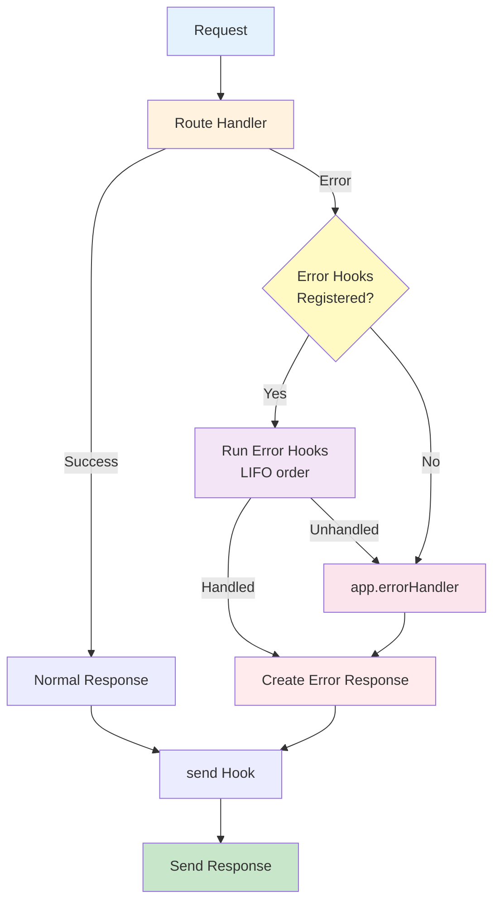

```mermaid
graph TB
    Start[Request] --> Handler[Route Handler]
    Handler -->|Success| Response[Normal Response]
    Handler -->|Error| ErrorCheck{Error Hooks<br/>Registered?}

    ErrorCheck -->|Yes| HookChain[Run Error Hooks<br/>LIFO order]
    ErrorCheck -->|No| FallbackHandler[app.errorHandler]

    HookChain -->|Handled| CreateResp[Create Error Response]
    HookChain -->|Unhandled| FallbackHandler

    FallbackHandler --> CreateResp
    CreateResp --> SendHook[send Hook]
    SendHook --> End[Send Response]

    Response --> SendHook

    style Start fill:#e3f2fd
    style Handler fill:#fff3e0
    style ErrorCheck fill:#fff9c4
    style HookChain fill:#f3e5f5
    style FallbackHandler fill:#fce4ec
    style CreateResp fill:#ffebee
    style End fill:#c8e6c9
```
