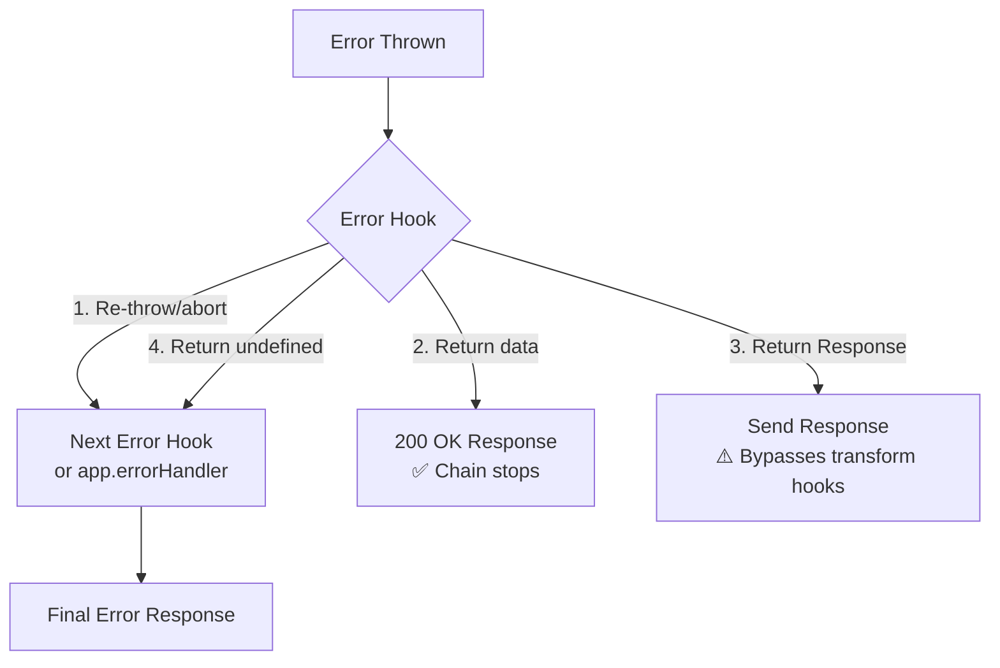

```mermaid
graph TB
    Start[Error Thrown] --> Hook{Error Hook}

    Hook -->|1. Re-throw/abort| NextHook[Next Error Hook<br/>or app.errorHandler]
    Hook -->|2. Return data| Success[200 OK Response<br/>✅ Chain stops]
    Hook -->|3. Return Response| Direct[Send Response<br/>⚠️ Bypasses transform hooks]
    Hook -->|4. Return undefined| NextHook

    NextHook --> Final[Final Error Response]

    class Start,Final danger
    class Hook accent
    class NextHook neutral
    class Success success
    class Direct warn

```
