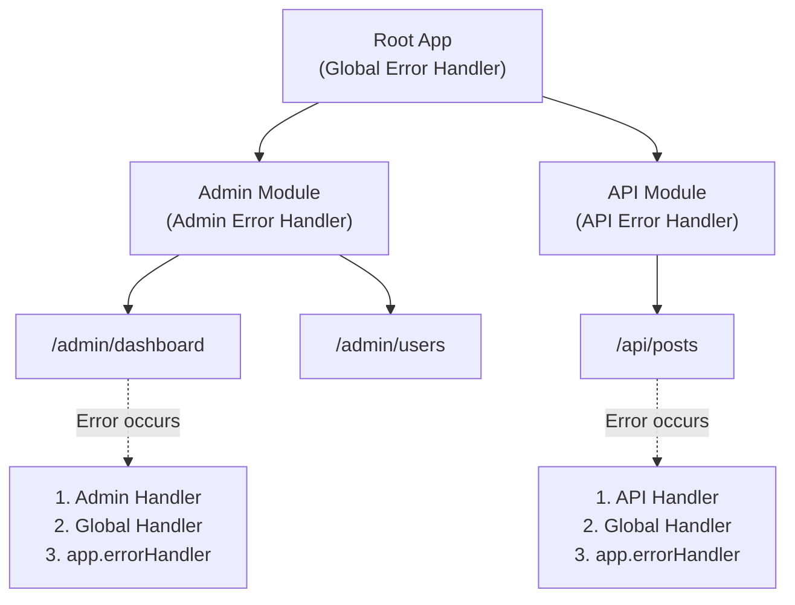

```mermaid
graph TB
    Root["Root App<br/>(Global Error Handler)"]
    Root --> Module1["Admin Module<br/>(Admin Error Handler)"]
    Root --> Module2["API Module<br/>(API Error Handler)"]

    Module1 --> Route1["/admin/dashboard"]
    Module1 --> Route2["/admin/users"]
    Module2 --> Route3["/api/posts"]

    Route1 -.->|Error occurs| Exec1["1. Admin Handler<br/>2. Global Handler<br/>3. app.errorHandler"]
    Route3 -.->|Error occurs| Exec2["1. API Handler<br/>2. Global Handler<br/>3. app.errorHandler"]

    class Root accent
    class Module1,Module2 info
    class Route1,Route2,Route3 neutral
    class Exec1,Exec2 warn

```
