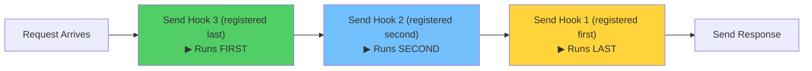

```mermaid
graph LR
    Start[Request Arrives] --> Hook3["Send Hook 3 (registered last)<br/>▶ Runs FIRST"]
    Hook3 --> Hook2["Send Hook 2 (registered second)<br/>▶ Runs SECOND"]
    Hook2 --> Hook1["Send Hook 1 (registered first)<br/>▶ Runs LAST"]
    Hook1 --> Handler[Send Response]

    style Hook3 fill:#51cf66
    style Hook2 fill:#74c0fc
    style Hook1 fill:#ffd43b
```

**Note**: LIFO order applies to Child → Parent hooks: `transform`, `send`, `error`, `close`, `timeout`. Parent → Child hooks like `request` use FIFO order.
