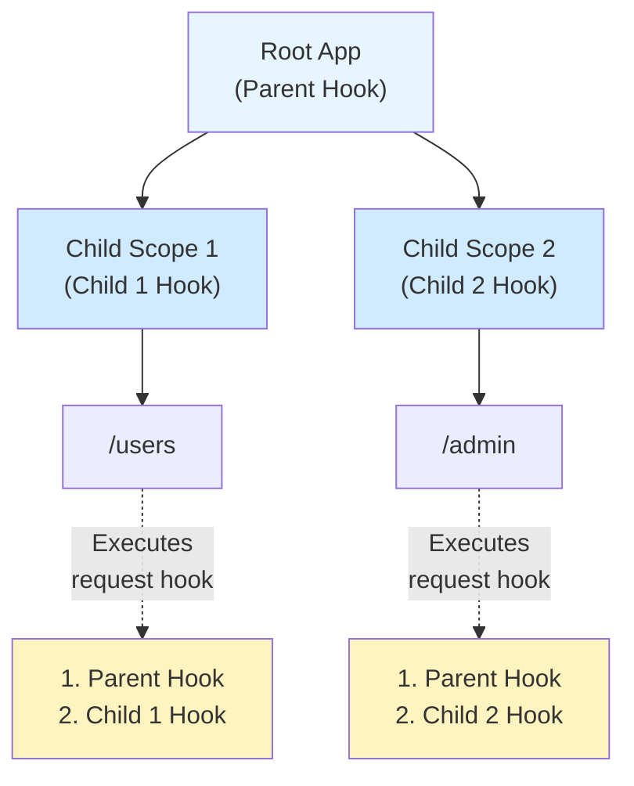

```mermaid
graph TB
    Root["Root App<br/>(Parent Hook)"]
    Root --> Child1["Child Scope 1<br/>(Child 1 Hook)"]
    Root --> Child2["Child Scope 2<br/>(Child 2 Hook)"]

    Child1 --> Route1["/users"]
    Child2 --> Route2["/admin"]

    Route1 -.->|Executes<br/>request hook| Exec1["1. Parent Hook<br/>2. Child 1 Hook"]
    Route2 -.->|Executes<br/>request hook| Exec2["1. Parent Hook<br/>2. Child 2 Hook"]

    style Root fill:#e7f5ff
    style Child1 fill:#d0ebff
    style Child2 fill:#d0ebff
    style Exec1 fill:#fff3bf
    style Exec2 fill:#fff3bf
```
