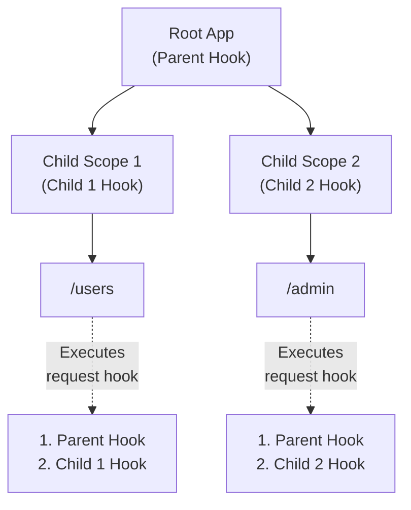

```mermaid
graph TB
    Root["Root App<br/>(Parent Hook)"]
    Root --> Child1["Child Scope 1<br/>(Child 1 Hook)"]
    Root --> Child2["Child Scope 2<br/>(Child 2 Hook)"]

    Child1 --> Route1["/users"]
    Child2 --> Route2["/admin"]

    Route1 -.->|Executes<br/>request hook| Exec1["1. Parent Hook<br/>2. Child 1 Hook"]
    Route2 -.->|Executes<br/>request hook| Exec2["1. Parent Hook<br/>2. Child 2 Hook"]

    class Root accent
    class Child1,Child2 info
    class Route1,Route2 neutral
    class Exec1,Exec2 warn

```
