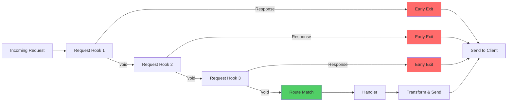

```mermaid
graph LR
    A[Incoming Request] --> B[Request Hook 1]
    B -->|Response| Exit1[Early Exit]
    B -->|void| C[Request Hook 2]
    C -->|Response| Exit2[Early Exit]
    C -->|void| D[Request Hook 3]
    D -->|Response| Exit3[Early Exit]
    D -->|void| E[Route Match]

    E --> F[Handler]
    F --> G[Transform & Send]

    Exit1 & Exit2 & Exit3 --> H[Send to Client]
    G --> H

    style Exit1 fill:#ff6b6b
    style Exit2 fill:#ff6b6b
    style Exit3 fill:#ff6b6b
    style E fill:#51cf66
```
