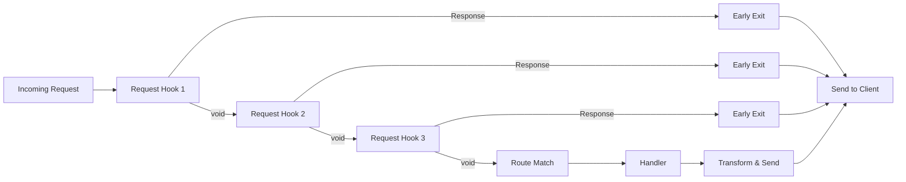

```mermaid
graph LR
    A[Incoming Request] --> B[Request Hook 1]
    B -->|Response| Exit1[Early Exit]
    B -->|void| C[Request Hook 2]
    C -->|Response| Exit2[Early Exit]
    C -->|void| D[Request Hook 3]
    D -->|Response| Exit3[Early Exit]
    D -->|void| E[Route Match]

    E --> F[Handler]
    F --> G[Transform & Send]

    Exit1 & Exit2 & Exit3 --> H[Send to Client]
    G --> H

    class A info
    class B,C,D accent
    class E,F neutral
    class G,H success
    class Exit1,Exit2,Exit3 danger

```
