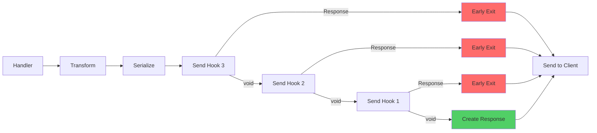

```mermaid
graph LR
    A[Handler] --> B[Transform] --> C[Serialize]
    C --> D[Send Hook 3]
    D -->|Response| Exit1[Early Exit]
    D -->|void| E[Send Hook 2]
    E -->|Response| Exit2[Early Exit]
    E -->|void| F[Send Hook 1]
    F -->|Response| Exit3[Early Exit]
    F -->|void| G[Create Response]

    Exit1 & Exit2 & Exit3 & G --> H[Send to Client]

    style Exit1 fill:#ff6b6b
    style Exit2 fill:#ff6b6b
    style Exit3 fill:#ff6b6b
    style G fill:#51cf66
```
