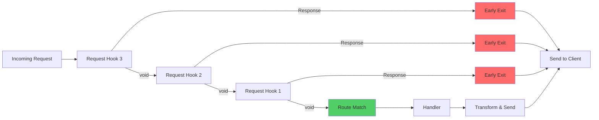
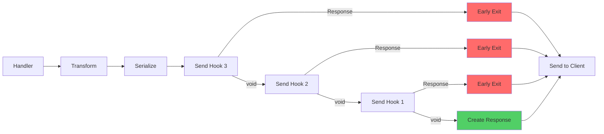

# Hooks

Hooks in Minima.js allow you to **tap into the application and request lifecycle**, enabling custom behavior at precise points. They are central to extending and customizing your application’s behavior.

## Application Lifecycle Hooks

Application lifecycle hooks are tied to the application's lifespan, ideal for managing resources, initializing services, or performing cleanup tasks.

### `hook.lifespan(setupFn)`

`hook.lifespan` provides a clean pattern to manage resources for the entire application. The `setupFn` runs on app startup and returns a cleanup function that executes on app shutdown.

This is perfect for managing database connections, message queues, or any resource that needs graceful setup and teardown.

```ts
import { createApp, hook } from "@minimajs/server";

const db = {
  async connect() {
    console.log("DB connected");
  },
  async disconnect() {
    console.log("DB disconnected");
  },
};

const app = createApp();

const dbLifecycle = hook.lifespan(async () => {
  await db.connect();

  // Return a cleanup function to run on app close
  return async () => {
    await db.disconnect();
  };
});

app.register(dbLifecycle);
```

## Request Lifecycle Hooks

Request hooks execute for each incoming request, allowing you to intercept, modify, and extend the request-response cycle.

### Defining Hooks

There are two primary ways to define request hooks:

- **`hook(name, handler)`**: Registers a single hook handler.
- **`hook.define({ ... })`**: Registers multiple hooks in a single, organized object.

Here’s how to define multiple hooks at once:

```ts
import { createApp, hook } from "@minimajs/server";

const app = createApp();

app.register(
  hook.define({
    request({ request }) {
      console.log("Incoming request:", request.url);
      if (request.url.pathname === "/maintenance") {
        return new Response("Under maintenance", { status: 503 });
      }
    },
    sent({ request }) {
      console.log("Sent response for:", request.url);
    },
  })
);
```

### The Request Lifecycle

Minima.js provides several built-in hooks that fire at different stages of the request lifecycle. Some hooks can even return a `Response` to short-circuit the cycle.

| Hook        | When                       | Use Case                               | Can Return Response |
| ----------- | -------------------------- | -------------------------------------- | ------------------- |
| `request`   | Before route matching      | Authentication, logging, rate limiting | ✅ Yes              |
| `transform` | After handler returns data | Transform or enrich response payload   | ❌ No               |
| `send`      | Before sending             | Modify headers, log response           | ✅ Yes              |
| `sent`      | After response sent        | Cleanup, metrics                       | ❌ No               |
| `error`     | On error                   | Format/log errors                      | ✅ Yes              |
| `errorSent` | After error sent           | Reporting or monitoring                | ❌ No               |
| `timeout`   | Request timeout            | Handle slow requests                   | ✅ Yes              |

> **Error Handling:** For detailed information on `error` and `errorSent` hooks, see the [Error Handling Guide](/guides/error-handling). For global error handling behavior, use [`app.errorHandler`](/guides/error-handling#custom-error-handler-apperrorhandler).

### Lifecycle Hook Examples

#### `request`

The `request` hook intercepts a request **before it reaches the route handler**. It's ideal for authentication, logging, rate limiting, or returning an early response to short-circuit the request lifecycle.

```typescript
// Authentication check
app.register(
  hook("request", ({ request }) => {
    if (!request.headers.get("authorization")) {
      // Early termination - bypasses route handler
      return new Response("Unauthorized", { status: 401 });
    }
  })
);

// Request logging
app.register(
  hook("request", ({ request, url }) => {
    console.log(`[${request.method}] ${url.pathname}`, {
      userAgent: request.headers.get("user-agent"),
      timestamp: new Date().toISOString(),
    });
  })
);

// Rate limiting
app.register(
  hook("request", ({ request }) => {
    const ip = request.headers.get("x-forwarded-for") || "unknown";
    if (isRateLimited(ip)) {
      return new Response("Too Many Requests", { status: 429 });
    }
  })
);
```

> **⚠️ Warning:** Returning a `Response` object bypasses the route handler, all subsequent `request` hooks, and the entire request lifecycle (transform, send hooks). Use `createResponseFromState` to preserve context headers.

**Flow:**



> **Important:** Hooks execute in **LIFO order** (last registered runs first). Returning a `Response` terminates the chain immediately and skips the route handler.

#### `transform`

The `transform` hook modifies response data returned by a handler before it is serialized.

```typescript
app.register(
  hook("transform", ({ data }) => {
    if (Array.isArray(data.users)) {
      data.users = data.users.map((u) => u.toUpperCase());
    }
    return data;
  })
);

app.get("/users", () => {
  return { users: ["Alice", "Bob"] };
});
// Response: { "users": ["ALICE", "BOB"] }
```

> `transform` hooks **cannot** return a `Response` object. They only modify data.
>
> **Alternative:** For global serialization behavior (e.g., custom JSON formatting, MessagePack), use [`app.serialize`](/guides/http#custom-serializer-appserialize) instead.

#### `send`

The `send` hook executes **just before creating the final `Response` object**, after data has been transformed and serialized. It receives the serialized response body and can modify headers via context.

```typescript
// Adding headers (recommended - preserves context state)
app.register(
  hook("send", ({ response }) => {
    response.headers.set("X-Custom-Header", "Minima.js");
    response.headers.set("X-Response-Time", `${Date.now() - startTime}ms`);
  })
);

// Logging serialized output
app.register(
  hook("send", (serialized, { request }) => {
    console.log(`[${request.method}] ${request.url.pathname}`, {
      bodySize: typeof serialized === "string" ? serialized.length : "stream",
      timestamp: new Date().toISOString(),
    });
  })
);
```

> **⚠️ Warning:** Returning a `Response` object bypasses the context's response state (headers, status). Only use for complete response overrides when absolutely necessary.

**Flow:**



> **Important:** Hooks execute in **LIFO order** (last registered runs first). Returning a `Response` terminates the chain immediately.

#### `sent`

The `sent` hook runs after the response is dispatched. Use it for cleanup or post-processing tasks that don't need to block the response.

```typescript
app.register(
  hook("sent", ({ request }) => {
    console.log(`Response sent for: ${request.url}`);
  })
);
```

### Request-Scoped Helpers

Minima.js also offers helpers for running logic within the scope of a single request.

#### `defer(callback)`

The `defer` hook registers a callback to be executed **after the response has been sent**, ideal for non-blocking tasks like analytics or logging.

```ts
import { createApp, defer } from "@minimajs/server";

const app = createApp();

app.get("/", (req, res) => {
  res.send({ message: "Hello World!" });

  defer(() => {
    console.log("Response sent, running deferred task...");
  });
});
```

> `defer` is a request-scoped equivalent of the global `sent` hook.

> For `onError` (request-specific error handling), see the [Error Handling Guide](/guides/error-handling).

## Hook Execution Order

Hooks execute in **LIFO order** (Last-In-First-Out) when registered in the same scope. The last hook registered is the first one to run.

```typescript
app.register(hook("request", () => console.log("First")));
app.register(hook("request", () => console.log("Second")));

// Output order:
// "Second" -> runs first
// "First"  -> runs last
```

Child scopes inherit hooks from their parents, but sibling scopes remain isolated.

```typescript
const app = createApp();

// Child scope 1
app.register(async (app) => {
  app.register(hook("request", () => console.log("Child 1")));
  app.get("/users", () => "users");
});

// Child scope 2
app.register(async (app) => {
  app.register(hook("request", () => console.log("Child 2")));
  app.get("/admin", () => "admin");
});
```

> A request to `/users` will only trigger hooks from **Child 1**, not from its sibling.

## Best Practices

- Use `hook.lifespan` for managing resources with clear setup and teardown logic.
- Use `defer` for non-blocking, post-response tasks like logging or analytics.
- Use `onError` for request-specific error handling that shouldn't be global.
- Reserve returning a `Response` from a hook for **short-circuiting** a request, such as in authentication or rate-limiting.
